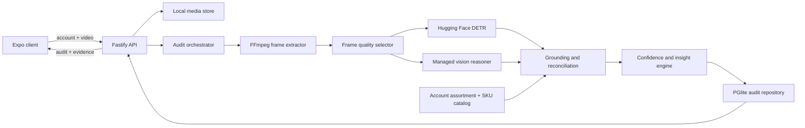

# Shelf Audit Vision Agent — Implementation Plan

## Document status

- Status: implementation in progress — Phase 1 complete
- Primary branch: `main`
- Default AI provider: xAI Grok
- Runtime strategy: TypeScript end to end
- Local persistence: embedded Postgres through PGlite
- Last updated: 2026-07-15

This document is the execution plan and progress tracker for the take-home assignment. Update the checkboxes only after the corresponding test gate passes. If implementation changes a material architectural decision, update the decision record near the end of this document in the same commit.

## 1. Objective

Build a small, defensible shelf-audit system that accepts a messy human-recorded retail shelf video and produces an evidence-backed structured audit tied to an account.

The system must prioritize trustworthy decisions over broad but unreliable recognition. It should identify what is visible, state what is uncertain or unobservable, avoid inventing missing planogram information, and turn its grounded observations into actions a field representative can take.

The intended core loop is:

1. A representative selects an account.
2. The representative records or uploads a shelf video.
3. The local API stores the video and extracts representative frames.
4. Local open-source perception locates likely bottles and contributes independent visual evidence.
5. A managed multimodal model reads selected frames against a strict schema and a small product catalog.
6. Application-owned grounding logic validates catalog matches, reconciles evidence across frames, calculates confidence, and derives actionable insights.
7. The final audit and its evidence pointers are persisted locally.
8. A minimal Expo client displays the audit, uncertainty, and supporting evidence.

## 2. Success criteria

The submission is successful when all of the following are true:

- A reviewer can install and run the application locally without Supabase, Docker, or a separately installed database server.
- The only required runtime network dependency is the selected AI provider. The first local-detector run may download and cache an open-source model from Hugging Face.
- A real, imperfect video can be captured or selected through the Expo application.
- The API extracts and selects frames from the actual video rather than analyzing a hand-picked still image.
- xAI Grok is the default reasoning provider.
- OpenAI, Anthropic Claude, and Google Gemini can be selected through configuration without changing pipeline code.
- The output conforms to one shared, versioned Zod schema.
- Important claims contain confidence, reasons, and frame-level evidence.
- Exact SKU, product-family, brand-only, and unknown matches are distinguishable.
- Missing observations are not automatically labeled out of stock.
- Out-of-stock and compliance claims require expected-assortment evidence.
- The audit is tied to a seeded local account and persists after a process restart.
- The result includes concise, defensible actions such as restock, pricing check, competitive response, or manual review.
- Automated tests cover the deterministic logic owned by the application.
- Paid provider calls are opt-in smoke tests and are never part of the default test suite.
- The README explains how to run the project, the buy/build boundary, limitations, and deliberate omissions.

## 3. Product principles

### 3.1 Evidence before assertion

Every important claim should reference one or more selected frames and, where available, normalized bounding boxes. A confidence score without evidence is insufficient.

### 3.2 Observation is not inference

The data model must distinguish:

- `observed`: directly visible and legible.
- `inferred`: supported indirectly but not directly readable.
- `uncertain`: plausible but conflicting or weakly supported.
- `not_observable`: the video does not provide enough evidence.
- `not_applicable`: the field does not apply to this audit.

### 3.3 Abstention is a valid result

If the brand is visible but size is not, return a product-family match and a null size. If a product cannot be catalog-grounded, retain the visible text as an unknown observation rather than fabricating a SKU.

### 3.4 Negative evidence requires coverage

Not seeing a SKU is not the same as proving it is absent. A possible out-of-stock condition requires:

- An expected SKU for the selected account.
- Adequate visual coverage of the expected shelf region.
- Evidence of an empty facing, shelf tag, or other placement signal.

Otherwise, the correct result is `not_determinable` or `not_observed`.

### 3.5 Insights must drive a decision

The final product is not a caption. The audit should surface a short prioritized list of actions with supporting reasons and evidence.

### 3.6 Rough UI, strong core

UI work is limited to what is needed to demonstrate capture, progress, results, evidence, and raw JSON. No time should be spent on animation, branding, custom theming, or dashboard polish.

## 4. Scope

### Must build

- Expo/React Native client with account selection and video capture/upload.
- Local TypeScript API.
- Local video and evidence storage.
- Embedded Postgres persistence through PGlite.
- Seeded accounts, products, and expected assortments.
- FFmpeg-based frame extraction.
- Quality-aware frame selection.
- Hugging Face DETR object detection through Transformers.js.
- Grok multimodal structured extraction.
- OpenAI, Claude, and Gemini provider configuration.
- Catalog grounding and multi-frame reconciliation.
- Per-claim evidence and confidence.
- Actionable insight generation.
- Automated deterministic tests.
- Opt-in live-provider smoke tests.
- Sample videos, evaluation fixtures, README, reflection, and walkthrough outline.

### Deliberately out of scope

- Training or fine-tuning a detector.
- Live inference during camera recording.
- Bottle tracking through every video frame.
- Exact store identification from shelf imagery.
- Full authentication or user management.
- Hosted Supabase deployment.
- Cloud queues or background-worker infrastructure.
- A planogram authoring tool.
- A large production SKU catalog.
- Production-grade resumable uploads.
- Statistical confidence calibration claims without sufficient evaluation data.
- Perfect share-of-shelf measurement under heavy occlusion.

## 5. Architecture



### Repository layout

```text
apps/
  mobile/                 Expo application
  api/                    Fastify server and processing pipeline
packages/
  contracts/              Shared Zod schemas, types, and enums
docs/
  IMPLEMENTATION_PLAN.md  This plan and tracker
samples/
  videos/                 Messy test videos safe to commit
  ground-truth/           Hand-authored expected observations
data/                     Ignored local runtime data
  pgdata/                 PGlite files
  uploads/                Original videos
  audits/                 Selected frames and crops
```

Use npm workspaces to avoid requiring another global package manager. A single root command should start the API and Expo development server.

## 6. Technology choices

| Concern            | Choice                                                                | Reason                                                                                 |
| ------------------ | --------------------------------------------------------------------- | -------------------------------------------------------------------------------------- |
| Mobile client      | Expo + React Native + TypeScript                                      | Matches the target production stack and supports camera/video workflows.               |
| API                | Fastify + TypeScript                                                  | Small, testable local server with multipart and schema-friendly routing.               |
| Contracts          | Zod                                                                   | One source for runtime validation, TypeScript types, and JSON Schema generation.       |
| AI abstraction     | Vercel AI SDK with direct provider keys                               | Normalizes multimodal and structured output across xAI, OpenAI, Anthropic, and Google. |
| Default model      | Configurable xAI Grok model, initially `grok-4.5`                     | Supports image input and structured output; model ID remains configurable.             |
| Local detector     | Quantized `Xenova/detr-resnet-50` through `@huggingface/transformers` | Provides generic bottle/object boxes without Python or training.                       |
| Video              | FFmpeg with a configurable binary path                                | Reliable frame extraction and metadata inspection.                                     |
| Image processing   | Sharp                                                                 | Resize, crop, normalize, and compute useful frame statistics in Node.                  |
| Persistence        | PGlite                                                                | Embedded file-backed Postgres without a server or Docker.                              |
| Testing            | Vitest                                                                | Fast unit and integration tests across TypeScript workspaces.                          |
| Formatting/linting | Prettier + ESLint                                                     | Consistent, automated code-quality checks.                                             |

## 7. DRY and SOLID boundaries

SOLID will be applied through small interfaces and composition, not a large class hierarchy.

### Single responsibility

Keep separate modules for:

- `VideoIngestor`
- `FrameExtractor`
- `FrameSelector`
- `LocalDetector`
- `ShelfReasoner`
- `CatalogGrounder`
- `ConfidenceCalculator`
- `InsightGenerator`
- `AuditRepository`
- `MediaStore`

### Open/closed and dependency inversion

The orchestrator depends on interfaces, with concrete implementations selected in one composition root. Adding another AI provider or media store should not change the orchestration or grounding logic.

### Liskov substitution

All provider implementations return the same validated `RawShelfAnalysis`. Callers must not branch on provider-specific response shapes.

### Interface segregation

Avoid a single `ShelfService` with unrelated persistence, inference, file, and business responsibilities. Prefer focused contracts with only the methods their consumers need.

### DRY rules

- Define audit schemas once in `packages/contracts`.
- Generate provider JSON Schema from the canonical Zod schema.
- Keep provider/model selection in one registry.
- Keep confidence and insight rules in one deterministic module each.
- Keep status enums and error codes shared.
- Keep SQL migrations as the persistence source of truth.
- Do not duplicate final audit data across normalized tables and JSONB during the take-home. Persist the versioned audit JSON as the canonical result.

## 8. Core contracts

### Evidence reference

```ts
type EvidenceRef = {
  frameId: string;
  timestampMs: number;
  region?: {
    xMin: number;
    yMin: number;
    xMax: number;
    yMax: number;
  };
  description: string;
};
```

Coordinates are normalized from 0 to 1 and must be validated before persistence.

### Claim wrapper

```ts
type Claim<T> = {
  value: T | null;
  status:
    "observed" | "inferred" | "uncertain" | "not_observable" | "not_applicable";
  confidence: number;
  confidenceLevel: "low" | "medium" | "high";
  reason: string;
  evidence: EvidenceRef[];
};
```

The numeric confidence is a documented heuristic, not a claim of statistical calibration.

### Product match levels

- `exact_sku`: brand, product, variant, and size/pack are sufficiently grounded.
- `product_family`: brand and product are grounded, but a defining variant or size is missing.
- `brand_only`: only the brand is reliable.
- `unknown`: no catalog entity can be defended.

### Audit record

The versioned `ShelfAudit` should include:

- Audit and schema version identifiers.
- Account resolution and method.
- Source video pointer and processing metadata.
- Capture-quality assessment and coverage warnings.
- Product observations with catalog candidates and match levels.
- Shelf position and facing estimates.
- Share-of-shelf estimates with an explicit denominator and scope.
- Expected assortment comparison.
- Possible out-of-stocks and their evidence state.
- Price and shelf-tag reads.
- Competitor products, displays, promotions, and price activity.
- Compliance flags.
- Prioritized actionable insights.
- Free-form notes.
- Overall review state.
- Provider, model, prompt, detector, and pipeline versions.
- Stage latency and provider usage when available.

### Separate raw and final schemas

The managed model returns `RawShelfAnalysis`, which contains observations and evidence but no trusted final business decision. Application logic transforms it into `ShelfAudit`.

This prevents prompt-generated calculations from silently becoming product truth and makes the most important logic testable without paid API calls.

## 9. Persistence model

Use raw SQL migrations compatible with ordinary Postgres where practical.

### Tables

#### `accounts`

- `id`
- `name`
- `external_identifier`
- optional address/region fields
- `created_at`

#### `products`

- `id`
- `brand`
- `product`
- optional `variant`
- optional `size`
- optional `pack`
- aliases and reference metadata as JSONB

#### `account_assortments`

- `account_id`
- `product_id`
- expected presence
- optional expected facings
- optional expected shelf position
- optional expected price

#### `audit_runs`

- `id`
- `account_id`
- status
- source video pointer
- selected provider and model
- schema/prompt/pipeline versions
- timestamps and stage latency
- error code and safe error message
- raw provider response as JSONB for debugging
- canonical final audit as JSONB

Do not store API keys, authorization headers, or base64 image payloads in the database.

### Audit state machine

```text
created
  -> uploading
  -> uploaded
  -> extracting_frames
  -> selecting_frames
  -> local_detection
  -> managed_reasoning
  -> grounding
  -> persisting
  -> completed

Any processing state may transition to failed.
Completed audits may be marked needs_review by the final audit record.
```

Transitions must be explicit and tested. On API startup, a simple recovery routine should mark abandoned in-progress local jobs as failed with a retryable error rather than leaving them permanently active.

## 10. Perception and reasoning pipeline

### Video validation

- Accept common phone video formats supported by the bundled/tested FFmpeg build.
- Enforce configurable maximum file size and duration.
- Reject empty or non-video uploads.
- Sanitize filenames and generate server-owned storage names.
- Read duration, dimensions, frame rate, and rotation metadata.

### Frame extraction

- Sample across the full duration, initially near one frame per second.
- Cap the candidate frame count.
- Apply orientation metadata.
- Resize provider frames while preserving enough label detail.
- Store timestamps in filenames and metadata.

### Quality and diversity selection

Rank frames using deterministic signals such as:

- Sharpness.
- Mean luminance and clipping.
- Entropy/information content.
- Temporal position.
- Near-duplicate distance.

Select approximately 8–12 frames that balance quality and coverage. Do not select only the sharpest cluster from one moment in the video.

### Local detection

Run quantized DETR on selected frames and retain relevant generic detections, initially bottle-like objects. Use the detector to:

- Produce independent object boxes.
- Suggest crops for closer managed-model inspection.
- Flag disagreement between claimed facings and visible bottle evidence.
- Contribute a weak confidence signal.

Do not use DETR class confidence as SKU confidence. The detector is trained for generic objects, not fine-grained beverage products.

### Managed-model extraction

Send the model:

- A concise system policy emphasizing evidence and abstention.
- The canonical raw extraction schema.
- Selected frames with stable frame IDs and timestamps.
- Useful detector boxes/crops and their generic labels.
- The selected account's small product catalog and expected assortment.
- Definitions for exact SKU, family, brand-only, unknown, and out-of-stock evidence.

Request observations rather than free-form captions. Set provider-side response storage off where supported.

### Catalog grounding

Application-owned grounding should:

- Normalize case, whitespace, units, and common aliases.
- Match exact catalog values first.
- Produce ranked candidates when exact matching fails.
- Refuse exact size/pack matches without supporting evidence.
- Retain unknown observations rather than dropping them.
- Detect and expose conflicts between frames.
- Deduplicate repeated views of the same shelf products.

### Confidence

Confidence should combine interpretable signals:

- Number of supporting frames.
- Agreement across frames.
- Frame quality.
- Directly legible text versus inferred appearance.
- Catalog-match specificity.
- Local detector overlap where relevant.
- Occlusion, glare, blur, and conflicts.

Start with documented deterministic rules and tiers. Do not tune arbitrary decimal weights to appear statistically calibrated.

### Insight generation

Generate insights deterministically where possible. Supported initial actions:

- `restock`
- `increase_facings`
- `pricing_check`
- `planogram_violation`
- `competitor_promotion`
- `manual_review`

Each insight contains:

- Priority/severity.
- Short title.
- Decision-oriented explanation.
- Recommended action.
- Confidence.
- Evidence references.

## 11. AI provider strategy

### Provider registry

Support configuration through environment variables:

```text
AI_PROVIDER=xai|openai|anthropic|google

XAI_API_KEY=
XAI_MODEL=grok-4.5

OPENAI_API_KEY=
OPENAI_MODEL=

ANTHROPIC_API_KEY=
ANTHROPIC_MODEL=

GOOGLE_GENERATIVE_AI_API_KEY=
GOOGLE_MODEL=
```

### Rules

- xAI is the documented default.
- Model IDs are configurable and centralized.
- Use direct provider credentials rather than requiring an AI gateway.
- Use a conservative common JSON Schema subset accepted across providers.
- Always validate the returned value with Zod even when a provider guarantees syntactic conformance.
- Never silently fall back to another provider, because that changes cost, privacy, and behavior.
- Return a clear configuration error when the selected provider lacks credentials.
- Capture provider/model identifiers and usage metadata without logging secrets.

### Fixture provider

Implement a deterministic fixture reasoner for tests and UI demonstrations. It must be visibly labeled as fixture mode and must not be presented as real extraction. Real demo videos must also be exercised through xAI and have their provider metadata persisted.

## 12. Local API surface

Keep the API intentionally small:

- `GET /health`
- `GET /accounts`
- `GET /accounts/:id/products`
- `POST /audits` — multipart account ID and video
- `GET /audits/:id` — processing state or completed audit
- `POST /audits/:id/retry` — retry a failed local job if safe
- `GET /media/:auditId/:asset` — serve allow-listed local evidence

The client polls audit status at a modest interval. Do not add WebSockets for this take-home.

## 13. Minimal client

### Screen/state 1: capture

- Select a seeded account.
- Record a short video with Expo Camera or choose an existing video.
- Display concise capture guidance: move slowly, cover each shelf, pause briefly on labels and price tags.
- Submit the video.

### Screen/state 2: processing

- Display current pipeline stage.
- Preserve the audit ID so the client can resume polling after a reload.
- Show retryable versus non-retryable errors.

### Screen/state 3: results

- Account and audit summary.
- Capture-quality warnings.
- Prioritized actions.
- Observed products with match level and confidence.
- Possible out-of-stocks and compliance concerns.
- Expandable evidence thumbnails and reasons.
- Raw JSON toggle for the technical walkthrough.

No authentication, charts, custom design system, animation, or elaborate navigation is needed.

## 14. Test strategy and responsible phase gates

### Default quality command

The root project should expose one command similar to:

```text
npm run check
```

It should run formatting checks, linting, TypeScript type checks, and all offline unit/integration tests. Every phase ends by running this command.

### Test layers

#### Unit tests

- Schema refinements and invalid examples.
- Product normalization and catalog matching.
- Match-level downgrade rules.
- Frame ranking and diversity selection.
- Confidence tiers.
- OOS abstention logic.
- Share-of-shelf calculations.
- Insight generation.
- State transitions.

#### Local integration tests

- PGlite migrations and persistence.
- Repository operations.
- Media path safety.
- FFmpeg metadata and frame extraction using a tiny committed fixture.
- Pipeline orchestration with fixture detector/reasoner.
- Fastify route validation.

#### Provider contract tests

- Recorded provider responses validate against `RawShelfAnalysis`.
- All configured provider factories satisfy the same interface.
- Missing credentials fail safely.
- Provider errors map to stable application error codes.

#### Opt-in live smoke tests

Separate commands should invoke each configured provider with one small test image. They must never run under `npm test` or CI by default.

#### Manual device checks

- Expo camera permission.
- Record and upload on a physical phone.
- LAN API configuration.
- Reload during processing.
- Evidence image rendering.

### Testing rules

- No test may require a hosted database.
- No default test may incur an API charge.
- Never commit API keys or raw environment files.
- Use small deterministic media fixtures for automated tests.
- Record actual messy-video results separately from unit-test fixtures.
- A phase is complete only when its exit criteria and test gate both pass.

## 15. Phased execution plan

Estimated times total approximately 6 hours at the low end and 7 hours 40 minutes at the high end. They are planning constraints, not an excuse to skip verification. If time runs short, cut optional breadth before weakening evidence, grounding, or tests.

### Phase 0 — Repository foundation and contracts

Target: 20–30 minutes

Tasks:

- [x] Rename/use `main` as the active implementation branch.
- [x] Initialize npm workspaces for `apps/mobile`, `apps/api`, and `packages/contracts`.
- [x] Pin and document a tested Node LTS version.
- [x] Configure TypeScript, ESLint, Prettier, and Vitest at the root.
- [x] Add root `dev`, `build`, `test`, `typecheck`, `lint`, and `check` commands.
- [x] Define shared enums for audit status, observation status, match level, confidence level, and insight type.
- [x] Define `EvidenceRef`, `Claim<T>`, `RawShelfAnalysis`, and `ShelfAudit` Zod schemas.
- [x] Add valid and invalid contract fixtures.
- [x] Add `.env.example` without secrets.
- [x] Update `.gitignore` for local media, PGlite data, caches, and environment files.

Test gate:

- [x] Contract schemas accept the canonical valid fixture.
- [x] Contract schemas reject invalid confidence, boxes, statuses, and missing required fields.
- [x] `npm run check` passes from the repository root.

Exit criteria:

- The workspace installs cleanly.
- Shared contracts compile in both client and API workspaces.
- No business logic or provider payload type is duplicated.

Completed 2026-07-15: `npm.cmd run check` passed with five contract tests. PowerShell uses `npm.cmd` because this environment blocks `npm.ps1` under its execution policy.

### Phase 1 — Local persistence, account context, and media storage

Target: 25–35 minutes

Tasks:

- [x] Add PGlite with file-backed storage under ignored `data/pgdata`.
- [x] Create SQL migrations for accounts, products, account assortments, and audit runs.
- [x] Seed one or two demo accounts.
- [x] Seed a deliberately small product catalog based on products available for test recording.
- [x] Seed expected assortment data required for OOS/compliance examples.
- [x] Implement `AuditRepository` and `PGliteAuditRepository`.
- [x] Implement `MediaStore` and `LocalMediaStore` with generated filenames.
- [x] Persist source-video pointers rather than video blobs.
- [x] Add explicit audit-state transition validation.
- [x] Add startup handling for abandoned in-progress jobs.

Test gate:

- [x] Migrations apply to a fresh temporary PGlite database.
- [x] Seed data is idempotent.
- [x] An audit survives closing and reopening a file-backed test database.
- [x] Invalid state transitions are rejected.
- [x] Media paths cannot escape the configured data directory.
- [x] `npm run check` passes.

Exit criteria:

- Local accounts and catalog records are queryable.
- A source media pointer and audit status can persist without external infrastructure.

Completed 2026-07-15: PGlite integration tests passed against fresh in-memory and file-backed databases; `npm.cmd run check` passed with nine total tests.

### Phase 2 — Video ingestion and first vertical slice

Target: 55–65 minutes

Tasks:

- [ ] Create the Fastify server and health route.
- [ ] Implement account-list and audit-status routes.
- [ ] Implement multipart audit creation with account validation.
- [ ] Validate upload size, duration, file type, and generated path.
- [ ] Integrate FFmpeg/ffprobe with a configurable binary override.
- [ ] Extract timestamped candidate frames from a test video.
- [ ] Add a basic frame selector with temporal coverage and a fixed cap.
- [ ] Implement the fixture `ShelfReasoner`.
- [ ] Orchestrate upload -> frames -> fixture analysis -> validation -> persistence.
- [ ] Expose completed audit JSON through the API.
- [ ] Record stage timing and safe failures.

Test gate:

- [ ] A committed tiny video fixture produces timestamped frames.
- [ ] Rotated video metadata is handled correctly or produces a documented warning.
- [ ] Invalid and oversized uploads fail with stable error codes.
- [ ] The fixture vertical slice persists a schema-valid audit.
- [ ] A failed stage leaves the audit in `failed`, not an intermediate state.
- [ ] Fastify route integration tests pass.
- [ ] `npm run check` passes.

Exit criteria:

- A local video can travel through the entire pipeline and produce a persisted fixture audit before paid inference is introduced.

### Phase 3 — Quality-aware frame selection and local perception

Target: 35–45 minutes

Tasks:

- [ ] Use Sharp to calculate frame sharpness, brightness, clipping, and entropy signals.
- [ ] Add near-duplicate rejection and temporal-diversity rules.
- [ ] Persist frame-selection scores and reasons.
- [ ] Implement `LocalDetector`.
- [ ] Integrate quantized `Xenova/detr-resnet-50` through Transformers.js.
- [ ] Cache the model outside source-controlled paths.
- [ ] Detect relevant generic objects and normalize boxes.
- [ ] Generate a limited set of useful crops without discarding overview context.
- [ ] Record detector version and availability.
- [ ] Degrade gracefully when detector initialization fails.

Test gate:

- [ ] Blurred/dark synthetic fixtures rank below clear fixtures.
- [ ] Near-duplicate frames are reduced while beginning/middle/end coverage remains.
- [ ] Bounding boxes are normalized and clamped.
- [ ] Detector output never maps directly to a catalog SKU.
- [ ] One opt-in local detector smoke test runs on a shelf frame.
- [ ] Pipeline succeeds with a recorded warning if the detector is unavailable.
- [ ] `npm run check` passes.

Exit criteria:

- The application uses a real open-source vision model as a supporting signal.
- Frame selection is explainable and robust enough for messy phone video.

### Phase 4 — Grok extraction and provider abstraction

Target: 55–65 minutes

Tasks:

- [ ] Add the AI SDK and direct xAI provider package.
- [ ] Implement the provider-neutral `ShelfReasoner` boundary.
- [ ] Make xAI the default provider and centralize model configuration.
- [ ] Build the schema-driven extraction prompt.
- [ ] Send selected overview frames, limited crops, detector manifest, catalog, and expected assortment.
- [ ] Require evidence references and explicit unknown states.
- [ ] Disable provider-side response storage where supported.
- [ ] Validate every response with the canonical Zod schema.
- [ ] Persist raw validated observations and provider metadata.
- [ ] Map timeouts, rate limits, refusals, invalid output, and authentication failures to stable errors.
- [ ] Add an explicit opt-in Grok smoke command.

Test gate:

- [ ] Prompt snapshots contain all schema rules and no secrets.
- [ ] Recorded Grok responses validate against `RawShelfAnalysis`.
- [ ] Malformed or semantically invalid responses fail safely.
- [ ] Provider errors do not leave partially completed audits.
- [ ] One messy video completes an opt-in real Grok run.
- [ ] The real run stores evidence IDs that refer to actual selected frames.
- [ ] `npm run check` passes after recording the sanitized fixture.

Exit criteria:

- The core real video -> Grok observations -> persisted structured record loop works.
- A reviewer can tell which fields were observed, inferred, uncertain, or not observable.

### Phase 5 — Grounding, confidence, and actionable insights

Target: 55–65 minutes

Tasks:

- [ ] Normalize catalog text, sizes, units, packs, and aliases.
- [ ] Implement exact and candidate catalog matching.
- [ ] Enforce exact-SKU downgrade rules when size/variant evidence is missing.
- [ ] Reconcile agreement and conflicts across frames.
- [ ] Deduplicate repeated views of the same shelf set.
- [ ] Implement documented confidence tiers and reasons.
- [ ] Calculate facings and share of shelf only with an explicit visible denominator.
- [ ] Implement expected-assortment comparison.
- [ ] Implement conservative OOS and compliance rules.
- [ ] Generate deterministic prioritized insights.
- [ ] Set the final `needs_review` state when high-impact claims are uncertain.
- [ ] Persist the final versioned `ShelfAudit`.

Test gate:

- [ ] Brand-only evidence cannot become an exact SKU.
- [ ] Missing expected SKU without coverage cannot become OOS.
- [ ] Conflicting size observations reduce match level and confidence.
- [ ] Repeated frames do not multiply facings.
- [ ] Share-of-shelf percentages use documented scope and sum consistently.
- [ ] High-impact low-confidence results create manual-review actions.
- [ ] Every actionable insight has evidence and a recommended action.
- [ ] `npm run check` passes.

Exit criteria:

- The application-owned layer, not the provider, controls catalog truth and business decisions.
- The final result is useful, conservative, and explainable.

### Phase 6 — Provider portability

Target: 15–25 minutes

Tasks:

- [ ] Add OpenAI provider configuration.
- [ ] Add Anthropic Claude provider configuration.
- [ ] Add Google Gemini provider configuration.
- [ ] Reuse the same `ShelfReasoner` contract and prompt inputs.
- [ ] Confirm the shared schema uses a compatible subset for every provider.
- [ ] Document environment variables and model selection.
- [ ] Avoid provider-specific logic in grounding, confidence, or UI modules.

Test gate:

- [ ] Provider registry selects the correct configured provider.
- [ ] Missing keys return provider-specific configuration errors.
- [ ] Offline provider-contract tests pass for every adapter.
- [ ] At least one non-xAI opt-in smoke test is run if credentials are available.
- [ ] `npm run check` passes.

Exit criteria:

- Provider selection is configuration-only.
- Grok remains the default and no silent fallback occurs.

### Phase 7 — Minimal Expo client

Target: 40–50 minutes

Tasks:

- [ ] Create the Expo application and shared-contract dependency.
- [ ] Implement configurable local API URL.
- [ ] Load and select a seeded account.
- [ ] Record video with Expo Camera and allow existing-video selection.
- [ ] Add short capture guidance.
- [ ] Upload the video with visible progress/error state.
- [ ] Persist the active audit ID locally.
- [ ] Poll processing status.
- [ ] Render quality warnings, actions, observations, uncertainty, and evidence.
- [ ] Add a raw JSON toggle.
- [ ] Keep styling intentionally basic and accessible.

Test gate:

- [ ] Client type checks against the shared contract package.
- [ ] API hooks handle loading, completed, failed, and retry states.
- [ ] Manual Expo web upload succeeds.
- [ ] Manual physical-device capture succeeds over the local network.
- [ ] Reloading during processing resumes the audit.
- [ ] Evidence images render only through allow-listed local routes.
- [ ] `npm run check` passes.

Exit criteria:

- A representative can complete the full core loop from a real phone or Expo development build.
- The UI demonstrates product value without consuming unnecessary implementation time.

### Phase 8 — Evaluation, resilience, and responsible failure handling

Target: 30–40 minutes

Tasks:

- [ ] Record at least one usable and one deliberately difficult shelf video.
- [ ] Include glare, angle, blur, partial occlusion, or unknown products across the set.
- [ ] Hand-author ground-truth observations for the committed samples.
- [ ] Build an evaluation script for exact SKU, family/brand, price, facings, OOS, and abstention metrics.
- [ ] Measure latency by pipeline stage and record provider usage.
- [ ] Test missing network/provider timeout behavior.
- [ ] Test restart handling for an interrupted processing audit.
- [ ] Verify that source media is not lost after a failed inference call.
- [ ] Document where confidence is heuristic and how it would be calibrated at scale.

Test gate:

- [ ] Evaluation script produces a repeatable report.
- [ ] OOS precision is reported separately from recall.
- [ ] Unknown/abstained results are measured rather than discarded.
- [ ] Bad input produces warnings or review requests rather than fabricated certainty.
- [ ] Retry does not create duplicate completed audits.
- [ ] `npm run check` passes.

Exit criteria:

- The submission contains concrete evidence of behavior on good and bad inputs.
- Failure modes and confidence limitations are measurable and plainly stated.

### Phase 9 — Submission package

Target: 30–40 minutes

Tasks:

- [ ] Expand README with prerequisites and exact local-run instructions.
- [ ] Document the buy/build boundary.
- [ ] Document why TypeScript was chosen over Python.
- [ ] Document PGlite-to-Supabase production migration.
- [ ] Document model/provider configuration and cost/latency tradeoffs.
- [ ] Attribute open-source models and dependencies.
- [ ] Add actual messy test videos within reasonable repository-size limits.
- [ ] Write the requested reflection:
  - latency and cost budget;
  - failure modes and wrong-read prevention;
  - offline/resumable-upload production design;
  - measurement and confidence calibration at scale;
  - deliberate omissions.
- [ ] Prepare a five-minute walkthrough outline around one real video and one important tradeoff.
- [ ] Run a secret scan and inspect tracked files.
- [ ] Test setup from a clean clone/directory.
- [ ] Capture final test and evaluation results in the README.

Test gate:

- [ ] Fresh local setup succeeds using only documented commands and one selected provider key.
- [ ] Fixture mode succeeds without a provider key and is clearly labeled.
- [ ] No secrets, local database files, caches, or unapproved media are tracked.
- [ ] All documentation links work.
- [ ] `npm run check` and the chosen real-provider smoke test pass.

Exit criteria:

- Repository, reflection, test media, and walkthrough material are ready to submit.

## 16. Time-box priority and cut order

If the implementation approaches the assignment time limit, preserve the working core in this order:

1. Real video ingestion and frame extraction.
2. Schema-valid Grok analysis.
3. Evidence, uncertainty, and catalog grounding.
4. Local persistence tied to an account.
5. Actionable insights.
6. Minimal Expo flow.
7. Local detector support.
8. Additional provider smoke testing.

Cut in this order:

1. UI refinements.
2. Retry UI beyond a basic action.
3. Non-xAI live smoke tests when credentials are unavailable.
4. Sophisticated frame similarity.
5. Optional OCR experiments.
6. Extra reports or charts.

Do not cut schema validation, evidence references, conservative OOS logic, deterministic tests, or the written reflection.

## 17. Risks and mitigations

| Risk                                  | Impact                         | Mitigation                                                                               |
| ------------------------------------- | ------------------------------ | ---------------------------------------------------------------------------------------- |
| VLM hallucinates an exact SKU         | Incorrect audit and lost trust | Catalog constraint, evidence requirement, match-level downgrades, multi-frame agreement. |
| Glare/blur removes label detail       | Low coverage                   | Frame-quality warnings, temporal diversity, abstention, manual-review insight.           |
| Similar bottle sizes are confused     | Incorrect SKU                  | Require legible size evidence; otherwise return family match and candidates.             |
| OOS inferred from non-observation     | False restock action           | Require expected assortment, coverage, and empty-placement evidence.                     |
| DETR misses crowded small bottles     | Weak local signal              | Treat detector as optional supporting evidence, never source of SKU truth.               |
| First detector run is slow            | Poor setup experience          | Use quantized model, cache it, document first-run download, allow graceful degradation.  |
| Provider changes model ID             | Broken setup                   | Central environment-based model configuration.                                           |
| Provider schemas differ               | Adapter failures               | Use common schema subset and always revalidate with Zod.                                 |
| Physical phone cannot reach localhost | Demo failure                   | Configurable LAN API URL and early device smoke test.                                    |
| FFmpeg platform mismatch              | Setup failure                  | Test the chosen binary strategy on the target environment and support `FFMPEG_PATH`.     |
| Video/API failure loses audit         | Rep must repeat aisle walk     | Save source media before processing and retain retryable failed audits.                  |
| Scope exceeds the time box            | Incomplete core                | Build vertical slice early and follow the cut order above.                               |

## 18. Security, privacy, and responsible handling

- Keep all provider keys server-side.
- Validate MIME type, size, duration, and generated file paths.
- Never expose arbitrary filesystem paths through media routes.
- Do not log authorization headers or base64 image data.
- Disable provider response storage when supported.
- Store only necessary local demo media and document how to delete it.
- Avoid recording people, private information, or store details without permission.
- Do not claim statistical calibration from a tiny evaluation set.
- Make fixture mode and real inference visually distinguishable.
- Persist provider/model/prompt/schema versions for reproducibility.

## 19. Progress reporting protocol

At the end of each phase:

1. Run the phase-specific tests.
2. Run `npm run check`.
3. Perform the listed manual smoke check when applicable.
4. Update only completed checkboxes.
5. Record any scope or decision change in the decision record.
6. Commit the phase as a focused change with the test results in the commit or handoff summary.

Do not begin a later phase merely to hide a failing earlier gate. Fix the gate or explicitly document and approve the changed scope.

## 20. Decision record

| Date       | Decision                                                               | Reason                                                                                                            |
| ---------- | ---------------------------------------------------------------------- | ----------------------------------------------------------------------------------------------------------------- |
| 2026-07-15 | Use a TypeScript npm-workspace monorepo.                               | Aligns with Expo and shares schemas across client, API, providers, persistence, and tests.                        |
| 2026-07-15 | Do not start with Python or a hybrid worker.                           | No training is planned; a second runtime would add setup and contract duplication without enough value.           |
| 2026-07-15 | Use xAI Grok as the default managed reasoner.                          | Requested default with current multimodal and structured-output support.                                          |
| 2026-07-15 | Support OpenAI, Claude, and Gemini through the same provider boundary. | Preserves portability without duplicating business logic.                                                         |
| 2026-07-15 | Use quantized DETR from Hugging Face as supporting local perception.   | Provides genuine open-source object localization in TypeScript without pretending to solve exact SKU recognition. |
| 2026-07-15 | Use PGlite and local files by default.                                 | Preserves Postgres semantics and persistence without hosted infrastructure or Docker.                             |
| 2026-07-15 | Treat account selection as workflow context.                           | User selection is more reliable than attempting to infer a store from shelf pixels.                               |
| 2026-07-15 | Keep raw observations separate from final business decisions.          | Makes grounding, confidence, OOS logic, and insights deterministic and testable.                                  |

## 21. Definition of done

The take-home is done when:

- A messy real video captured through the client yields a schema-valid audit.
- The audit is persisted and tied to the selected account.
- Claims show evidence and uncertainty.
- Exact SKU and OOS assertions follow conservative grounding rules.
- The final result provides clear actions rather than only descriptions.
- xAI is the working default and provider switching is configuration-driven.
- Local DETR contributes a real but appropriately limited perception signal.
- The full default test suite passes without paid services.
- At least one real-provider smoke run and messy-video evaluation are documented.
- A fresh reviewer can run the project locally from the README.
- The reflection and walkthrough address both what works and what was deliberately not built.
