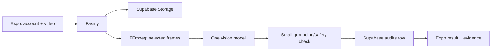

# Shelf Audit Take-Home — Minimal Delivery Plan

## Goal

Demonstrate one complete, honest workflow:

1. Select an account.
2. Capture or upload a short, messy shelf video.
3. Extract a few representative frames.
4. Ask one vision model for a structured reading against the account catalog.
5. Return and persist a schema-valid audit that distinguishes visible facts from uncertainty.
6. Display the audit and its frame evidence in a rough Expo screen.

This is a take-home, not a platform. Every implementation choice must make that demo clearer to a human reviewer.

## What we are building

### Small stack

- TypeScript monorepo with a Fastify API, Expo client, and shared Zod schema.
- Supabase Postgres and Supabase Storage.
- FFmpeg for frame extraction.
- One vision model/provider at a time.
- Fixture mode for offline automated tests.

### One provider, chosen by a short spike

Start with Grok because it is the requested/default candidate. Before building the full pipeline, run one real messy shelf frame through it and inspect the result.

- If it produces usable, evidence-grounded shelf reads, use Grok for the submission.
- If it does not, use one better-performing supported vision provider and document that choice.
- Do not build a provider registry or multiple adapters. The application calls one `analyzeShelf()` function.

The point is a sound buy/build judgment, not a configurable AI framework.

## Persistence: Supabase, kept deliberately small

Use Supabase because Postgres is explicitly part of the assignment. Do not add an ORM, migration framework, repository layer, queue, or background worker.

Create these three tables with SQL in the Supabase dashboard and keep the SQL in `docs/supabase.sql`:

```sql
create table accounts (
  id uuid primary key,
  name text not null
);

create table products (
  id uuid primary key,
  account_id uuid not null references accounts(id),
  brand text not null,
  product_name text not null,
  variant text,
  size text,
  expected_on_shelf boolean not null default true
);

create table audits (
  id uuid primary key,
  account_id uuid not null references accounts(id),
  source_video_path text not null,
  audit_json jsonb not null,
  created_at timestamptz not null default now()
);
```

Seed two accounts and a tiny account-specific catalog (three to five products each). Store source video and selected evidence frames in one private Storage bucket. The `audits` row stores the final JSON and the source-video pointer—nothing more.

Use the Supabase JavaScript client directly. A few explicit queries in the route are easier to review than an abstraction layer.

## Audit schema: broad, nullable, and honest

The schema should expose the shelf-audit surface the reviewer expects, even when the video cannot support a value. Schema breadth is cheap; fabricated certainty is expensive.

Every measurable field has:

```ts
{
  value: T | null;
  confidence: number; // 0 to 1
  reason: string;
  evidence: EvidenceRef[];
}
```

Use `value: null` with a low confidence and an explanation such as “label obscured by glare” when the video does not support a read. Do not omit fields merely because the model could not see them.

The final shared Zod schema must cover:

- account and source-video references;
- capture-quality warnings;
- catalog-grounded product observations: brand, product, variant, size/pack, facings, shelf position, and price;
- product match level: `exact`, `family`, `brand_only`, or `unknown`;
- share of shelf, including a nullable value and visible-scope explanation;
- competitor observations, including nullable brand/product/facings fields;
- expected-assortment and out-of-stock assessment;
- notes and frame-level evidence.

Do **not** add an actions/recommendations system. It is not requested and does not improve the structured audit.

## Safety rules

Keep application-owned logic small and explicit:

- Exact SKU requires catalog-supported brand, product, and size/variant evidence. Otherwise downgrade to family, brand-only, or unknown.
- A missing expected product is not out of stock. `possible` OOS requires expected-assortment context plus visible empty-facing, shelf-tag, or equivalent placement evidence. Otherwise return `not_determinable`.
- Share-of-shelf may be null unless the visible denominator is stated.
- Price, facings, competitor, and shelf-position values may be null. That is a successful abstention, not an error.
- Every non-null high-impact value needs selected-frame evidence.

## The pipeline



### API

Keep the API to these routes:

| Route                          | Purpose                                                          |
| ------------------------------ | ---------------------------------------------------------------- |
| `GET /health`                  | Setup smoke check.                                               |
| `GET /accounts`                | Account picker.                                                  |
| `POST /audits`                 | Upload, process synchronously, save, and return the final audit. |
| `GET /audits/:id`              | Reload a completed audit.                                        |
| `GET /media/:auditId/:frameId` | Serve only allow-listed evidence frames.                         |

For a short take-home video, synchronous processing is simpler and sufficient. Show a loading state in Expo; do not build audit queues, workers, polling, retries, resumable upload, or a job state machine.

### Video handling

- Validate a short MP4/MOV/WebM upload and store it under a generated path.
- FFprobe checks duration; FFmpeg extracts one frame per second, up to 12 candidates.
- Select at most six evenly spaced frames.
- Optionally flag only obvious darkness or blur. Do not build quality-scoring, duplicate-reduction, or frame-ranking machinery unless real sample videos prove that even spacing fails.

### VLM input and output

Send the selected overview frames, the selected account’s small catalog, expected products, and a concise schema/rules prompt.

The model returns observations, not business truth. Validate with Zod, then apply the safety rules above. Fixture mode returns a recorded schema-valid response and never calls a paid provider.

### Local detector

Only include a local detector if the assignment explicitly requires it. If included:

- place one small generic detector call behind `LOCAL_DETECTOR_ENABLED=true`;
- return generic label, confidence, and normalized box evidence only;
- never map detector classes to SKUs;
- do not generate crops, add detector database columns, or create a second processing pipeline;
- treat failure as one warning and continue.

If it cannot be implemented this way, document it as an omission. It must not delay the core video-to-audit loop.

## Build order

Use this as a flat checklist. Do not begin optional work before the previous item is demonstrably working.

- [ ] Create the final broad Zod schema with nullable measurements and evidence references.
- [ ] Add `docs/supabase.sql`, create/seed the three Supabase tables, and verify one direct JS-client read/write.
- [ ] Create `GET /health` and `GET /accounts`.
- [ ] Save a video to Storage, extract up to six evenly spaced frames, and return a fixture audit.
- [ ] Persist and reload the final audit row from Supabase.
- [ ] Run the one-frame Grok quality spike; choose the single submission provider.
- [ ] Implement `analyzeShelf()`, validate provider output, and apply exact-match/OOS safety rules.
- [ ] Capture and commit a few actual messy shelf videos used during development, plus hand-authored expected observations. These are required deliverables.
- [ ] Test the chosen provider once against a real messy sample and record what it got wrong or could not see.
- [ ] Build one Expo screen: account selection, capture/choose video, submit, loading, result, evidence, and raw JSON.
- [ ] Add only high-signal tests: invalid upload, fixture end-to-end audit, malformed provider response, exact-SKU downgrade, unsupported OOS, persisted audit reload, and media allow-listing.
- [ ] Write the README and reflection: setup, Supabase setup, model choice, cost/latency, observed failure modes, calibration limits, and deliberate omissions.

## Code-size guardrail

Keep handwritten TypeScript under 2,000 physical lines in total, including tests. This is a guardrail, not a feature to optimize at the expense of an explicit assignment requirement such as Postgres, the broad structured schema, or messy sample videos.

When code starts growing, cut unrequested abstractions first:

1. provider portability;
2. background processing and retry infrastructure;
3. detector crops and detector persistence;
4. elaborate frame scoring;
5. UI polish;
6. analytics, actions, dashboards, and planogram features.

Do not cut Supabase/Postgres, evidence, nullable uncertainty fields, conservative OOS logic, real sample media, or the core Expo demonstration.

## Definition of done

A reviewer can set the Supabase variables, run the API and Expo app, choose an account, submit one of the included messy videos, and inspect a persisted, schema-valid audit.

The audit shows:

- what was visible and catalog-grounded;
- facings, position, price, share-of-shelf, and competitor fields when observable;
- nulls with evidence-backed reasons when they were not observable;
- conservative OOS assessment tied to account expectations;
- the exact frames that support every material claim.

The README states plainly what the model got wrong, what it could not determine, and why the solution intentionally stops there.
